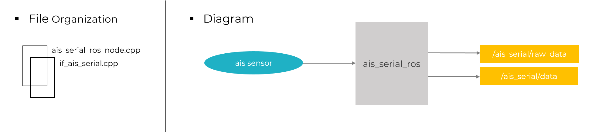

# ais_serial_ros


This package is defined for using an USB AIS Sensor. It allows users to receive and to parse messages from ais sensor, publish ROS message (raw frame and custom ais data), and to send ais raw frame through a udp link.


<div align="center">



**Fig.1** Diagram of ais_serial_ros package
</div>

## **Installation**

### Installation from Packages

Clone the repository (*use the last version*)

```
cd catkin_ws/src
git clone https://github.com/rdouguet/ais_serial_ros.git
```

### Building from sources
#### Dependencies
* Download and build the [marnav library](https://github.com/mariokonrad/marnav)
* Install the serial ros package

```
sudo apt-get install ros-melodic-serial
```

#### Building

```
cd catkin_ws
catkin_make --only-pkg-with-deps ais_serial_ros
```

## **Running**
A launch file allows to define some parameters about udp and debug mode

* **ais_serial.launch**
    - `/ais_serial_ros_node/addr_udp_server`
    - `/ais_serial_ros_node/udp_port`
    - `/ais_serial_ros_node/udp_output_enable`
    - `/ais_serial_ros_node/debug_info`

This launch file allows to run the ais_serial_ros node.

```
roslaunch ais_serial_ros ais_serial.launch
```

## **Config files**
A configuration file allows to define the parameters for com port.

* **ais_serail.yaml**
	* `/ais_serial_ros_node/portName`
	* `/ais_serial_ros_node/baudRate`

Udev rules can be defined for communication port, in order to avoid modifying the port in configuration if it has changed.
[Udev documentation](https://wiki.debian.org/udev)

A symlink can be configured and defined to uniquely identify the connected device. <br />
Once it is done, configuration file could be updated `portName: "/dev/mySerial_ais"`.

## **Published Topics**

* **`ais_serial/raw_frame`**

  Provides the raw ais frame received by the ais sensor

* **`ais_serial/data`**

  Provides informations about ais targets


